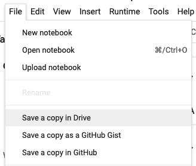

# Brookhaven/Fermi Accelerator National Labs AI/ML Modules

# Using these notebooks 
This program is written using [colab notebooks](https://colab.research.google.com/notebooks/basic_features_overview.ipynb), so you will have access to these materials long after the summer. 
Just click the `open in Colab` link for any given topic to see the materials in an interactive environment. 
To save your work - click the `Save a copy in Drive` button under the `File` menu, now any changes you make to the notebook (including solutions and notes) are all your own. 

## Fermilab Schedule 

### Group 1 
| Day  | Topic | Slides | Notebook |
| ------------- |------------- |-------------| -------------|
| 1      | Introduction to Python for Science| [link](https://docs.google.com/presentation/d/1rTdhyjryut-woPliMeRFvXEILXpHkM_O_Q_Pz5nY2FI/edit?usp=sharing)     |      | | |
| 2      |Regression and Classification with SGD | -     |      | | |
| 3      |Deep Neural Networks | [link](https://docs.google.com/presentation/d/15v2LebFvTTC0m4xNpE2EkzPe-RMwZb4GxQ3z4PW8Omw/edit?usp=sharing)     |    | | |
| 4      |Convolutional Neural Networks | [link](https://docs.google.com/presentation/d/1GUPf2pCBxNch-KI--KSnxFP8LmAiqSc0HZLOeavULQw/edit?usp=sharing)    |  

## Group 2 

| Day  | Topic | Slides | Notebook |
| ------------- |------------- |-------------| -------------| 
| 1      |Deep Neural Networks | [link](https://docs.google.com/presentation/d/15v2LebFvTTC0m4xNpE2EkzPe-RMwZb4GxQ3z4PW8Omw/edit?usp=sharing)     |     
| 2      |Convolutional Neural Networks | [link](https://docs.google.com/presentation/d/1GUPf2pCBxNch-KI--KSnxFP8LmAiqSc0HZLOeavULQw/edit?usp=sharing)    |      | | | 
| 3 - 4     |Challenge Project! | [link](https://docs.google.com/presentation/d/18po48vOW5kaHPABbzvpAna5_u3dYzQZmSrK84K0BYM0/edit?usp=sharing)     |   | 
